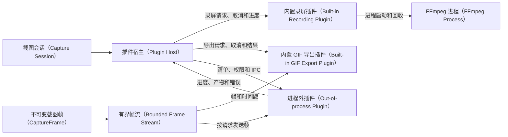

# 开发设计思路

更新日期：2026-09-07

本文档是 Flash Shot 唯一的开发设计来源，说明组件职责、依赖方向、生命周期、验证边界和演进顺序。
版本目标与切片状态只写入[主线开发计划](plan.md)；产品需求、Windows 验收、分发和 Linux 可行性文档
只记录各自职责内的事实，不得复制或改写路线图与架构决策。

## 术语表与命名约定

| 规范名称 | English / 缩写 | 当前职责边界 | 不代表什么 |
| --- | --- | --- | --- |
| 工作区根目录 | Workspace Root | 虚拟 Cargo workspace，统一依赖、默认成员、版本和仓库级检查 | 不是可运行包或第二个二进制入口 |
| 领域库 | Domain Crate / `flash-shot-domain` | 几何、选区、截图会话、标注文档和产品状态机等纯值与规则 | 不是 GPUI 界面、Windows API 或图像编码器 |
| 图像库 | Image Crate / `flash-shot-image` | 不可变截图帧、物理像素采样、裁切、标注合成、二维码识别和 PNG/JPEG/WebP 编码 | 不是 Windows 捕获设备或 GPUI 视图 |
| 可复用截图核心库 | Reusable Capture Core / 候选 `flash-shot-capture-core` | 面向其他 Rust 项目提供平台无关的截图请求、帧处理、标注合成、导出和取消边界 | 不是 GPUI 界面、Windows 资源适配器、系统剪贴板或桌面常驻程序 |
| 捕获适配器 | Capture Adapter | 将操作系统的显示器、窗口或区域捕获转换为核心库可消费的 `CaptureFrame` | 不是核心库的业务流程、UI 控件或公共 ABI |
| 导出管线 | Export Pipeline | 按调用方选择完成裁切、标注合成、编码、原子写入并返回可诊断错误 | 不是历史索引、设置保存或系统通知 |
| Windows 基础设施库 | Windows Infrastructure Crate / `flash-shot-infra-windows` | 显示器、捕获、快捷键、托盘、剪贴板、自启动、目录、进程、窗口、光标和辅助滚轮的 Windows 实现 | 不是应用用例、界面或组合根 |
| 应用库 | Application Crate / `flash-shot-app` | GPUI 装配、产品用例、持久化策略、状态反馈和迁移期兼容导出 | 不是 Cargo 应用入口或 Windows 服务 |
| 开发工具模块 | Development Tool Modules / `dev-tools` | 库内可选的 Release 验收、压力和资源探针，由唯一二进制调度 | 不是发布包中的独立 EXE 或普通用户入口 |
| 插件宿主 | Plugin Host | 在主程序内登记插件、检查清单与权限、转发请求、进度、取消和错误，并负责资源清理 | 不是插件实现、第三方市场或操作系统服务 |
| 插件清单 | Plugin Manifest | 描述插件 ID、API 版本、能力、权限、入口和资源限制的版本化元数据 | 不是插件代码签名本身，也不是用户数据或运行时状态 |
| 插件能力 | Plugin Capability | 插件清单声明、宿主授权并可被请求的有限功能，例如录屏或帧导出 | 不是未声明的操作系统权限或任意 API 访问 |
| 插件权限 | Plugin Permission | 宿主授予插件的最小资源范围，例如读取有界帧流或写入指定输出目录 | 不是 Windows 用户权限、管理员权限或全局授权 |
| 插件接口约定 | Plugin API / API | 宿主与插件之间稳定的请求、响应、错误、进度和取消字段 | 不是 Rust 私有模块调用或未经版本化的动态库 ABI |
| 有界帧流 | Bounded Frame Stream | 在固定帧率、时长和内存预算内向导出能力提供带时间戳的 `CaptureFrame` | 不是无限缓存、完整桌面历史或可由插件任意修改的截图帧 |
| 导出插件 | Export Plugin | 消费宿主提供的帧或单帧并生成 GIF、WebP 等可选产物 | 不是屏幕采集后端、窗口控制器或系统剪贴板所有者 |
| 进程外插件 | Out-of-process Plugin | 通过版本化 IPC/stdio 与宿主隔离运行的独立插件进程 | 不是当前主程序内的 Rust trait 实现或无权限的任意脚本 |
| 应用入口 | Application Entry / `flash-shot` | `crates/flash-shot-bin` 中唯一的二进制目标，负责启动桌面应用并装配具体服务 | 不是压力测试命令集合 |
| 界面层 | UI Surface | 当前位于 `flash-shot-app/src/app` 的 GPUI 页面、覆盖层、Pin 和设置视图；未来可按稳定边界提取 | 不是业务规则、平台实现或截图像素源 |
| 本地化资源 | Locale / `UiText` | 与 OCR/外部翻译无关的 English/简体中文 UI 资源和参数化模板 | 不是翻译服务响应或报告字段 |
| 截图会话 | Capture Session | 一次从触发采集到完成、取消或失败清理的用户操作范围 | 不是常驻窗口或历史记录条目 |
| 截图帧 | CaptureFrame | 由采集后端产生、供预览和导出的不可变物理像素数据 | 不是 GPUI 纹理或压缩文件 |
| 操作代次 | Operation Generation | 标识当前异步操作是否仍可向界面提交结果的递增值 | 不是版本号或历史条目序号 |
| 拆除屏障 | Teardown Barrier | 在窗口、任务、输入和临时资源清理完成前阻止下一次采集的状态检查 | 不是操作系统同步原语或持久化锁 |
| 资源所有者 | Resource Owner | 负责提交或释放窗口、文件、剪贴板写入和外部进程资源的当前操作 | 不是业务数据的持久化拥有者 |
| 界面度量 | ThemeMetrics | 跨页面共享的颜色语义、间距、尺寸和命中区参数 | 不是截图像素或平台 DPI 值 |
| 剪贴板提交检查点 | Clipboard Commit Checkpoint | `ClipboardCommitGate` 在不可逆剪贴板写入前提供的最后可取消边界 | 不是实际的系统剪贴板写入，也不是消费者确认 |
| 隔离剪贴板观察器 | Isolated Clipboard Observer | `dev-tools` 验收中接收候选 `CaptureFrame` 的进程内观察通道 | 不是生产系统剪贴板或外部应用消费者 |

正文、目录示例、代码和报告统一使用这些名称；标准协议、Cargo、GPUI、Windows 和 FFmpeg 保留标准大小写。

## 1. 设计目标与约束

Flash Shot 是 Windows-first 的原生 Rust/GPUI 截图与录屏工具。设计优先保证低延迟、物理像素正确、失败可恢复、
资源有界和 UI 可验证，不以拆分数量或新功能数量作为架构目标。

1. GPUI 只负责界面、输入和呈现，不拥有领域规则或 Windows API 细节。
2. 平台 API 藏在描述产品操作和错误的接口后，平台实现集中在 `flash-shot-infra-windows`。
3. 截图帧（`CaptureFrame`）是不可变像素所有者；预览、标注合成、复制和保存不得无谓地往返编码。
4. 长耗时工作在后台执行器中运行，带取消、操作代次/资源所有者检查和可观察失败状态。
5. 设置、历史和标注文档带版本；原子写入失败时保留可重试的旧状态。
6. 只保留一个 `flash-shot` 二进制，开发工具通过 `dev-tools` 特性和 `scripts/run-dev-tool.ps1` 调度。

## 2. 当前工作区与依赖方向

当前实现是五个 Cargo workspace 成员，根目录默认只选择 `crates/flash-shot-bin`：

```text
flash-shot-bin
  -> flash-shot-app
       -> flash-shot-infra-windows
            -> flash-shot-image
                 -> flash-shot-domain
       -> flash-shot-image
       -> flash-shot-domain
```

`flash-shot-bin` 是唯一组合根，负责单实例、诊断、设置/历史初始化、Windows 资源和 GPUI 启动。`flash-shot-app`
提供 UI、workflow、录屏、识别、历史和状态反馈，并通过兼容导出维持已有调用方。`flash-shot-infra-windows` 提供
原生实现；`flash-shot-image` 和 `flash-shot-domain` 不依赖 GPUI、HWND、COM、FFmpeg 或具体 OCR 运行时。

未来是否提取独立 `flash-shot-ui` 或 `flash-shot-acceptance`，取决于稳定的依赖和发布边界；当前先在应用库内按职责
拆分模块，不预先增加 crate 或二进制。开发工具继续作为库模块，避免把验收路径误发布为用户程序。

### 2.1 可复用截图核心 crate 评估

结论是**可以提取，但不应把 `flash-shot-app` 整体发布为通用库**。当前工作区已经有可复用的基础：
`flash-shot-domain` 提供几何、选区、截图会话和标注规则，`flash-shot-image` 提供不可变像素帧、裁切、标注合成和
PNG/JPEG/WebP 编码。它们都不依赖 GPUI；这部分适合成为其他 Rust 桌面应用、命令行工具或服务端图像处理流程的共享基础。

建议的目标边界如下：

```text
其他 Rust 项目
  -> flash-shot-capture-core（候选公共 API）
       -> flash-shot-domain
       -> flash-shot-image
  -> flash-shot-infra-windows（Windows 捕获适配器，可选）

flash-shot-app（GPUI、设置、历史、Pin、录屏、i18n）
  -> flash-shot-capture-core
```

候选 `flash-shot-capture-core` 只负责平台无关的请求和结果编排。第一版公共 API 应保持小而明确：

- `CaptureRequest` 描述目标类型、物理区域、是否包含光标和尺寸约束；平台相关目标通过 `CaptureTarget` 或适配器接口表达，
  不暴露 `HWND`、COM 或 GPUI 类型；
- `CaptureBackend` 接收请求并返回不可变 `CaptureFrame`，调用方可以用内置适配器，也可以提供自己的屏幕、窗口或测试后端；
- `CaptureFrame`、`PhysicalRect`、`AnnotationDocument` 和导出选项提供裁切、标注合成、物理像素校验和编码入口；
- `ExportPipeline` 负责原子文件写入、取消检查点和有界错误详情，返回结构化 `CaptureError`，不直接操作历史索引、通知或 UI；
- 取消、资源所有权和操作代次通过显式请求上下文表达，不依赖全局变量、线程本地状态或特定 async runtime。

不应进入该公共 crate 的内容包括 GPUI 页面和覆盖层、全局快捷键、托盘、Pin 窗口、系统剪贴板、FFmpeg 录屏、历史数据库、
用户设置、本地化文案、Windows 窗口检查和 `dev-tools` 验收 runner。它们需要桌面生命周期或产品策略，放入公共核心会让依赖、
资源清理和版本兼容一起变重。

现阶段不立即新增公共 crate，原因是边界还需要先冻结：

1. `flash-shot-app::platform` 仍存在迁移期兼容导出，捕获接口和 Windows 资源所有权尚未完全脱离应用用例；
2. `flash-shot-image` 目前同时包含编码、字体和二维码能力，公共发布前应以 Cargo feature 拆出可选依赖，避免最小使用方承担完整依赖树；
3. 保存、复制和取消的失败语义需要形成不依赖 UI 文案的结构化错误与测试约定；
4. 公共 API 需要独立的跨平台 mock backend、golden image、原子文件和取消竞态测试，并明确 MSRV、语义化版本和许可证说明；
5. 当前仓库使用 `AGPL-3.0-only`，向其他项目发布或被闭源软件链接前必须单独完成许可证兼容性评估，不能把“能编译”当成发布许可结论。

推荐的落地顺序是：先在现有 workspace 内提取并稳定私有 `capture-core` 模块，接入 Flash Shot 自身；再把领域和图像类型的
公共 API、feature、错误和测试固定后，创建 `flash-shot-capture-core` crate；最后才考虑 Windows 适配器 crate 或 C ABI/IPC。
这样可以复用核心算法，也不会把 Windows-first 的产品生命周期误包装成通用截图 API。该评估不承诺当前版本已经提供可供第三方
直接依赖的稳定 crate。

### 2.2 `0.3.0+` 插件扩展方向

插件扩展建立在稳定的截图会话和资源所有权之上，不改变当前 Windows 主链的窗口、输入、剪贴板和 FFmpeg 清理规则。
插件宿主只暴露版本化的插件接口约定；插件清单先经过 API 版本、能力、权限和资源限制检查，再决定是否加载。



内置录屏插件先复用现有 FFmpeg 进程边界；GIF 插件只消费有界帧流，负责帧率、时长、尺寸和调色板限制，不直接采集
桌面。第三方能力首选进程外插件，以便宿主对崩溃、超时、取消、文件产物和安装包可选组件做隔离；不把 Rust 动态库
ABI 当作第一版公共接口。主程序仍负责 `CaptureSession`、`CaptureFrame`、HWND、全局快捷键、系统剪贴板和清理，
插件只能通过宿主请求访问这些能力。

#### 2.2.1 插件接口对象与版本规则

`Plugin Manifest` 至少包含 `manifest_version`、`plugin_id`、`plugin_version`、`api_version`、`entry`、
`capabilities`、`permissions`、`resource_limits` 和本地化显示信息。宿主先校验清单的结构、版本、唯一 ID、入口和资源上限，
再按 `Plugin Capability` 与 `Plugin Permission` 建立本次任务的授权；任何未知必填版本或越过资源上限的请求都在启动前拒绝。

宿主与插件之间只使用版本化的 `Plugin API` 对象：`ExportRequest` 描述一次单帧或帧流导出，`FrameStream` 提供带时间戳的
不可变 `CaptureFrame`，`PluginEvent` 传递进度/产物/完成状态，`PluginError` 统一表达拒绝、超时、取消、崩溃、协议和输出失败。
对象字段必须有长度、数量、帧率、时长和文件大小上限；新增字段默认可忽略，删除或改变语义必须提升 API 版本。

#### 2.2.2 插件宿主生命周期

1. 发现阶段只读取受信任的插件目录和清单，不启动插件进程，也不打开截图窗口或系统剪贴板。
2. 检查阶段验证 API 版本、插件 ID、能力、权限、入口和资源限制；失败只写诊断，不改变截图主链状态。
3. 启动阶段为每个任务分配请求 ID、取消令牌、临时目录和资源所有者；进程外插件加入 Job Object 或等价进程组。
4. 运行阶段只转发已授权的请求、有限帧和状态事件；宿主限制消息大小、帧率、时长、输出目录和等待时间。
5. 结束阶段先停止帧流，再等待或终止插件，回收进程/句柄/临时文件，最后提交产物或返回本地化错误；过期事件只能释放自身资源。

内置插件可以复用应用库的 Rust 实现，但仍遵循相同的 `Plugin API`、资源限制、取消和错误报告；第三方插件默认进程外运行，
不把 Rust 动态库 ABI 作为公共扩展边界。插件缺失、禁用或崩溃不得阻塞 Capture、Copy、Save、Pin 和核心启动。

## 3. 数据与生命周期

### 3.1 截图主链

```text
全局快捷键或托盘命令
  -> 截图会话（Capture Session）
  -> 显示器提供器（DisplayProvider）/ 捕获后端（CaptureBackend）获取物理像素
  -> 一个不可变截图帧（CaptureFrame）
  -> GPUI 覆盖层选择、标注预览和操作状态
  -> 图像库（Image Crate）确定性合成与裁切
  -> 剪贴板服务（ClipboardService）/ 原子文件写入 / Pin / 可选 OCR
```

覆盖层只是一次截图会话的界面；设置窗口按需打开，关闭时只隐藏，不注销全局快捷键或托盘。Save、Copy、Pin、
Cancel 和再次 Capture 共享显式的拆除屏障（Teardown Barrier）：在原生窗口延迟关闭完成、后台任务归零且
`capture_preflight_ready=true` 前，不开始下一次全屏采集。

### 3.2 标注模型

标注文档使用逻辑图像坐标和稳定 ID。GPUI 渲染将文档坐标变换到视口，导出始终以原始截图帧的物理尺寸
合成。鼠标移动只产生草稿预览，正式提交才进入可撤销命令历史；取消、零尺寸和竞争手势不得写入历史。

### 3.3 异步所有权

识别、保存、历史缩略图、录屏发现/启动和滚动拼接都绑定操作代次或具体资源所有者。完成回调必须先确认：

- 请求仍属于当前会话、历史根目录和条目；
- 目标窗口、文件占用标记、剪贴板写入 slot 或 FFmpeg 子进程仍由当前操作拥有；
- 取消、关闭或新操作没有使结果过期。

过期结果只释放自己的资源，不写回新的 UI 状态。历史缩略图保持有界 FIFO 和最多两个并行解码任务；单条失败
显示可重试状态，不阻塞截图主链。

选择复制的后台 worker 先在图像库完成标注合成和物理像素裁切，再通过
`ClipboardService::copy_image_cancellable` 进入剪贴板提交检查点。`SelectionCopyCancellation` 接收第一个
Escape：在 `ClipboardCommitGate::begin_clipboard_commit` 成功前，取消只丢弃已准备的帧并释放选择复制与剪贴板写入的
操作所有权；提交开始后，取消只等待写入完成，不声称可以恢复已经改变的剪贴板。Windows `SystemClipboard` 在
`OpenClipboard` 成功后、`EmptyClipboard` 之前取得提交资格。`dev-tools` 的 `copy-cancellation-race` 使用隔离
剪贴板观察器在同一检查点暂停 worker，runner 通过真实 Copy 和 Escape 输入验证取消顺序，既不改变生产实现也不写入
系统剪贴板。

### 3.4 录屏与外部进程

FFmpeg 由录屏 workflow 管理，状态使用 `idle/starting/recording/paused/stopping/failed`。启动阶段先建立
Job Object/等价的进程边界和输出读取器；任何中途失败都终止并回收已创建子进程。正常停止优先发送控制输入，
超时才强制终止；stdout/stderr 始终被消费并限制错误详情，不能把外部输出原文写进用户状态或日志。

## 4. UI 设计原则

界面层使用统一的界面度量（`ThemeMetrics`）和语义颜色，而不是页面内散落固定颜色和尺寸：

- Surface：`canvas`、`surface`、`surface_elevated`、`surface_hover`；
- Content：`text`、`text_muted`、`text_disabled`；
- Action：`accent`、`accent_hover`、`accent_pressed`、`focus`；
- Status：`success`、`warning`、`danger`、`info`；
- Geometry：4px 间距基线、稳定 toolbar/control 命中区、圆角不超过 8px。

Capture 覆盖层保留 Copy、Save、Pin、Cancel 作为主要动作，滚动、OCR、录屏和诊断进入 More 或对应页面的次级区。
Library 以最近截图和筛选为主，Record 以当前目标和生命周期为主，App 以设置和全局状态为主，Pin 只保留图片与轻量
工具栏。每个区域最多一个视觉最强的主要动作；复制、保存、缩放、关闭等熟悉命令优先使用图标和 tooltip。

布局必须在 English/简体中文、浅色/深色和 420x420、520x640、980x760 下保持文本不截断、控件不重叠、焦点可见；
视觉截图只证明布局，像素、快捷键、窗口和资源清理仍由原生验收报告单独证明。

## 5. 平台边界

应用用例通过以下小接口表达系统能力，接口定义操作和产品错误，不逐一暴露 Windows API：

- `CaptureBackend`、`DisplayProvider`；
- `GlobalShortcutService`、`TrayService`；
- `ClipboardService`、`AutoStartService`；
- `WindowInspector`、窗口可见性控制和 `RecordingBackend`。

`flash-shot-app::platform` 只保留迁移期兼容导出。只有当应用用例不再直接依赖具体系统集成、接口约定测试和真实验收
能够独立运行时，才把剩余实现移动到 Windows 基础设施库。

## 6. 演进顺序

1. 先关闭剪贴板、文件系统、FFmpeg 和标注输入的失败/恢复证据，冻结当前行为与报告 schema。
2. 完成 `Locale`/`UiText` 动态状态盘点，再收敛 App、Library、Record 的信息层级和三种窗口尺寸。
3. 先拆原生验收 runner 的一个职责，再拆 `overlay.rs` 的一个职责；每步使用同一场景对照测试和 Release 报告。
4. 有真实硬件时执行 150%/200% 单显示器矩阵；双屏、真实翻译和跨平台另立范围，不混入当前切片。
5. 只有前述证据稳定且全量门禁通过，才准备 `v0.2.0` 候选版或评估 GPUI 依赖升级；插件平台按主线计划的 P3.0-P3.4
   分阶段设计和验收，不与当前稳定性切片混合。

## 7. 验证策略

- 领域几何、会话、标注文档、命令和配置：纯单元测试；
- 图像合成、坐标和编码：golden image、物理像素和文件原子性测试；
- Windows 基础设施：接口约定测试、资源释放测试和真实桌面探针；
- GPUI 页面与工具栏：双语、双主题、三尺寸截图和真实键鼠验收；
- 录屏、剪贴板和历史：确定性故障 fixture 加同一 Release session 的进程/窗口/文件清理报告；
- workspace 根目录统一运行 `cargo fmt --all -- --check`、`cargo check --workspace --all-targets`、
  `cargo clippy --workspace --all-targets -- -D warnings`、`cargo test --workspace` 和 `git diff --check`。
- 使用 `dev-tools` 特性的检查还需运行 `cargo check --workspace --all-targets --all-features --locked` 和
  `cargo test --workspace --all-features --locked`；在 Windows 主机可用时再运行
  `cargo check -p flash-shot-app --target x86_64-pc-windows-msvc --all-targets --all-features --locked`。
  严格全特性 Clippy 已通过；后续结构重构仍须保持该检查通过。

完成条件以 [主线开发计划](plan.md) 和 [Windows 手工验收记录](windows-manual-acceptance.md) 为准；本设计文档只
说明职责、依赖和演进规则，不复制逐次运行日志。
